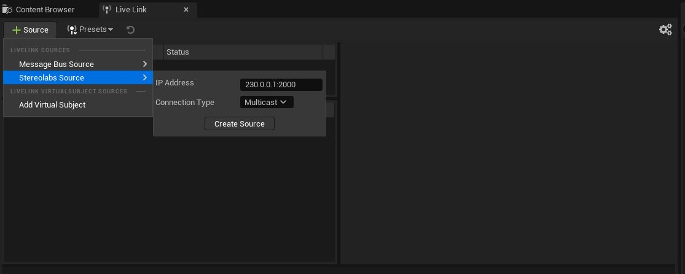

# Stereolabs ZED - Live Link Sample
ZED LiveLink Sample for Unreal Engine 5.

**Important**: Starting from the version 4.1.0 of the ZED SDK, the ZED Live Link plugin has been reworked.
This new sample contains :

- a *real* Unreal plugin that can be added to any UE project.
- a mono and fusion sender that **do not** need to be compiled using the **Unreal Engine source files** anymore.

If you find any bugs or have feedback regarding this new sample, please contact us at support@stereolabs.com

## Set up Live Link Plugin

### Import the plugin

This plugin allows you how to use the body tracking data sent through Live Link to animate 3D avatars.

- Create a new Unreal 5 project if you don't have one already.
- Go into the root folder of your Unreal Project (where the "Content" folder is located).
- Copy the **ZEDLiveLink** folder in the "**Plugins**" Directory of your project. Create a "Plugins" folder if it does not already exist.

The next time you build and open the Unreal project, the ZEDLiveLink plugin should be visible (and enabled) in the Plugins window (Edit -> Plugins).

### Set up a scene

You only need to add a **BP_ZEDLivelink_Manager** to your scene to make it operational with our plugin. It's available under `Plugins/ZEDLiveLink/Content/Blueprints/Animation/BP_ZEDLivelink_Manager.uasset`.

A sample scene called "LiveLinkMap" is available under `Plugins/ZEDLiveLink/Content/`.

### Connect to a Live Link Source

The "LiveLinkMap" level no longer automatically connects to a live link at Start. Now, you need to do it manually by selecting a Source in the Live Link window.

- Open the Live Link window (Window -> Virtual Production -> Live Link).
- Click on **Source** -> **Stereolabs Source**. 
- Set the IP address of the sender, and the type of connection (Unicast or Multicast)
- Click on **Create Source**.

## Senders

> **Note:** The senders **do not** need to be compiled using the **Unreal Engine source files** anymore. You can build them like any other application using CMake. Please refer to the [documentation about our samples](http://localhost:1313/docs/samples/) for guidance if needed.

### Live Link Config Files

The senders come with specific configuration files, "ZEDLiveLinkConfig.json" and "ZEDFusionLiveLinkConfig.json".

They can be used to configure the Body Tracking and Fusion parameters. You can also edit the code directly like you would with any other body tracking sample, and remove the part about reading the config file.

By default, the senders need these files. You can either put them right next to the built executable apps or pass the path to them as a command line argument of their respective sender.

### zed-livelink-mono

This sample can be used to send camera tracking data and skeleton data from one camera into Unreal Engine 5 using Live Link.

### zed-livelink-fusion

This sample can be used to send skeleton data from multiple cameras using the Fusion API (introduced in the 4.0 version of the ZED SDK) into Unreal Engine 5 using Live Link.

> **Note:** Make sure to put the path to your ZED360-generated Fusion configuration file in "ZEDFusionLiveLinkConfig.json", under `json_config_filename`.